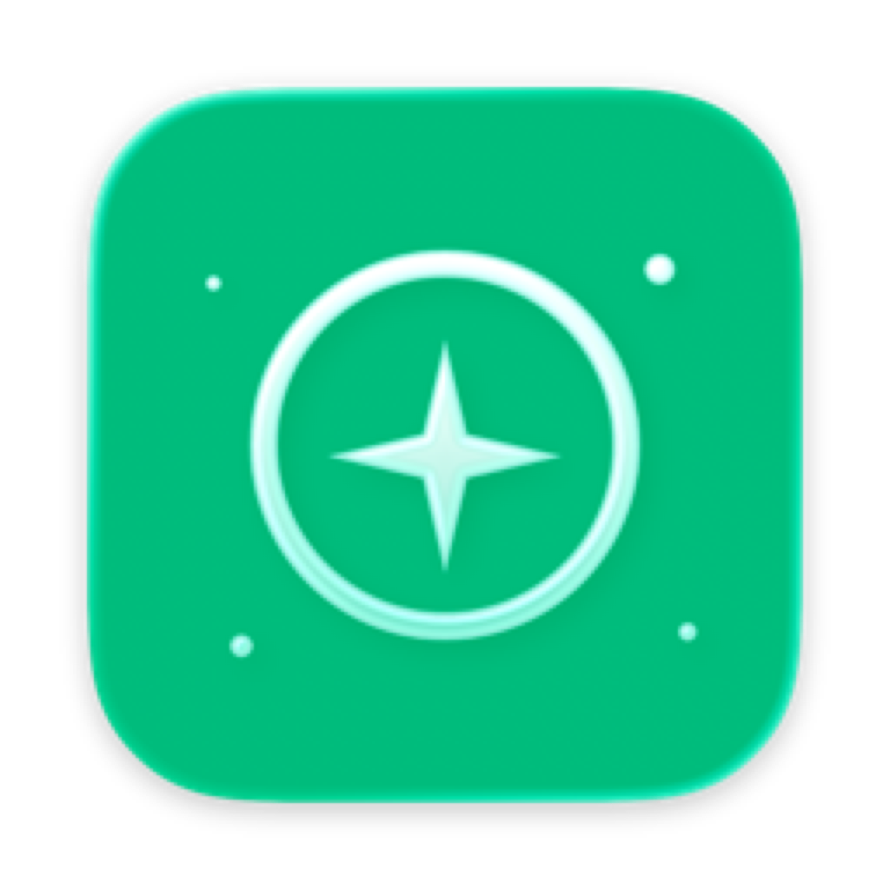
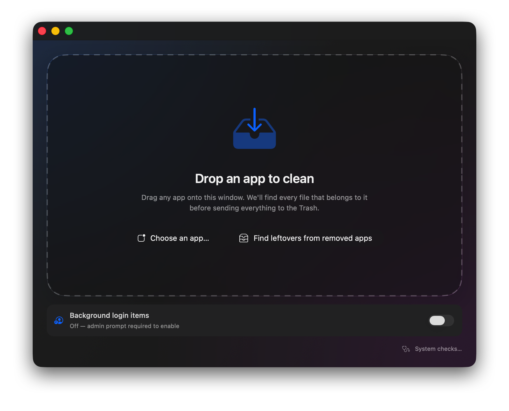
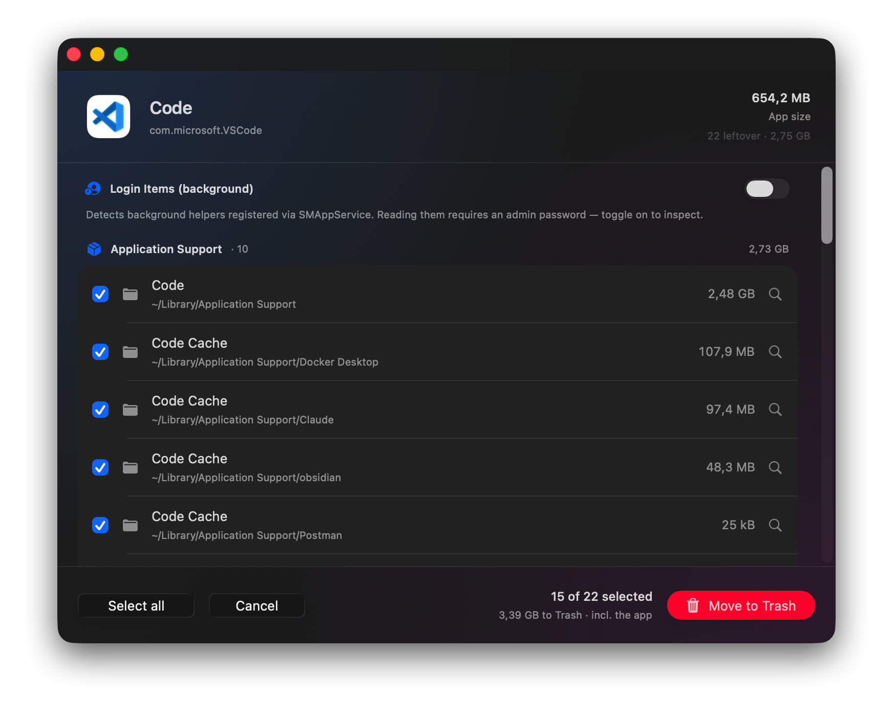
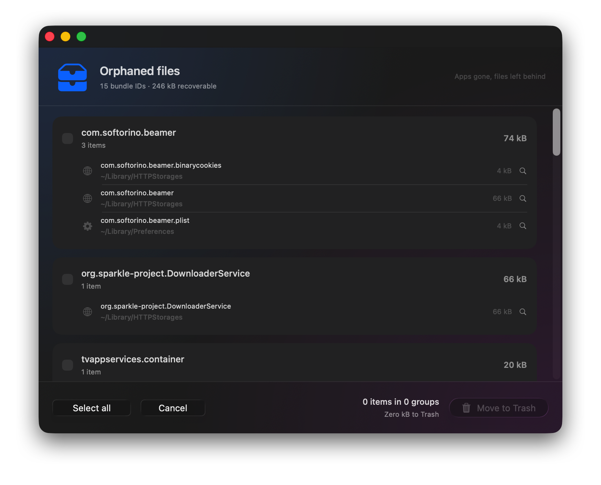
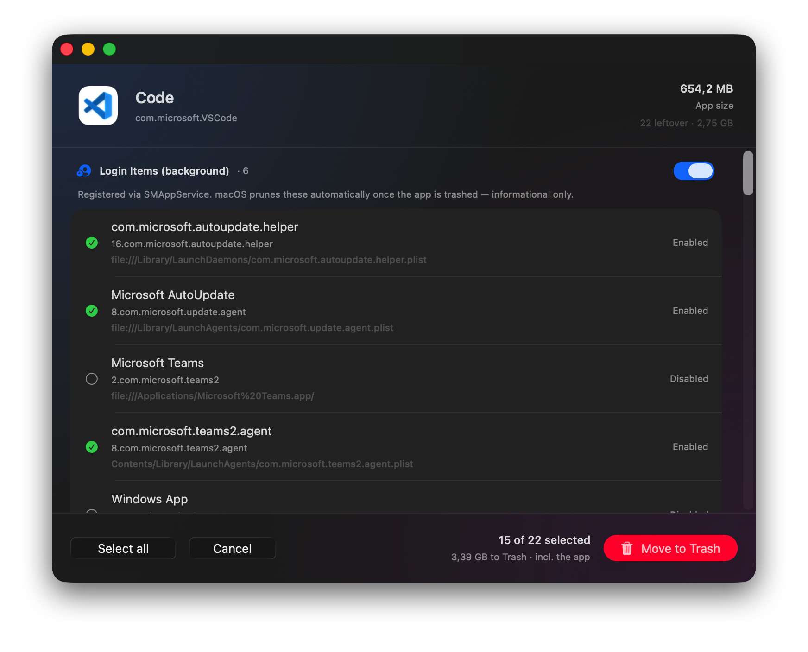
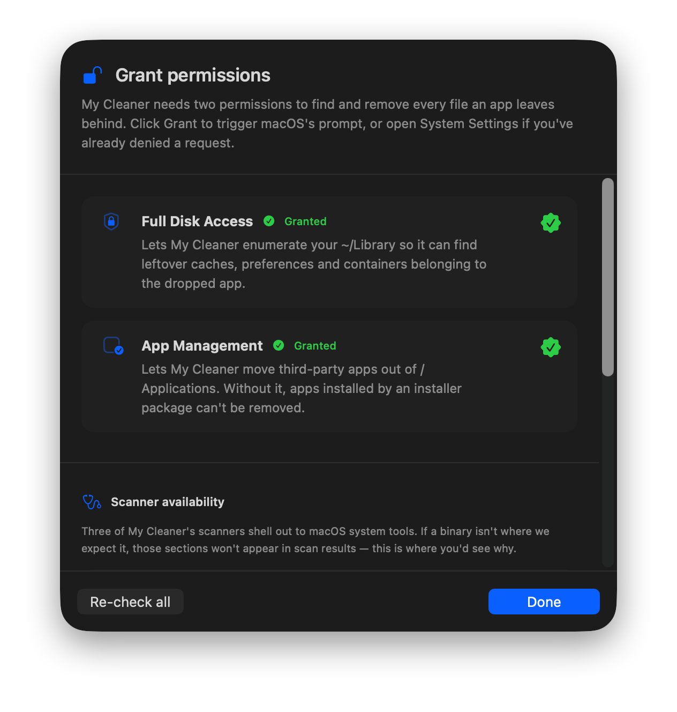

  

<h1 align="center">MyCleaner</h1>

  A macOS utility that finds every file an app has scattered around your Mac,
  then moves the lot — together with the app itself — to the Trash. 
  Built with SwiftUI and the new Liquid Glass material.

  

## Why this exists

MyCleaner is **open source, free, and built for personal use** — shared
with everyone tired of paying for software this small yet so important
to have. No sign-up, no subscription, no in-app purchase, no trial timer.
The source is right here; if you don't trust it, read it.

I'm a software engineer, but Mac and Swift aren't my day job. If
something looks unidiomatic, the UI could use polish, or you spot a
better approach anywhere in the code, pull requests are very welcome —
see [Contributing](#contributing).

## What it does

Drop a `.app` onto the window. MyCleaner walks `~/Library` and `/Library`,
locates files that belong to the app, and lists them in a categorised,
toggleable view. Confirm and everything you ticked is sent to the Trash in
one shot, along with the app bundle.

Matching strategy:

- **Bundle identifier** — exact or `<bundleID>.*` prefix, plus the
  `group.<bundleID>` form used in App Groups and the
  `iCloud~<tilde-encoded-bundle-id>` form used under
  `~/Library/Mobile Documents`.
- **Team identifier** — read from the app's code signature via
  `SecCodeCopySigningInformation`. Used only for `~/Library/Group Containers`
  so we can surface shared bundles like Microsoft Office's
  `UBF8T346G9.Office`. Those are flagged as *shared with other apps from
  this developer* and default to **off**.
- **Name hints** — the display name, the last reverse-DNS component of the
  bundle ID, and the `.app` filename. Each is matched at word boundaries
  (next character must be a non-letter), so JetBrains `RiderXXXX.X` matches
  but `RiderProjects` does not.
- **Vendor descent** — for `Application Support`, `Caches`, and `Logs`, the
  scanner descends one level past non-Apple folders so it can reach things
  like `~/Library/Application Support/JetBrains/Rider2025.3/`.
- **Spotlight pass** — after the directory walk, `mdfind` is queried for
  files whose `kMDItemCFBundleIdentifier` matches the dropped app. Catches
  Info.plists and helper bundles in places the walk doesn't enter (e.g.
  `/Library/Frameworks`, vendor install dirs).

## Categories surfaced

`Application Support` · `Caches` · `Preferences` (incl. `ByHost`) ·
`Containers` · `Group Containers` · `Logs` · `Crash Reports`
(`DiagnosticReports`) · `Saved Application State` · `Cookies & Web Data`
(Cookies, HTTPStorages, WebKit) · `Launch Items` · `Application Scripts` ·
`iCloud Documents` (Mobile Documents).

## Post-cleanup bookkeeping

After items are sent to the Trash, MyCleaner also:

- Runs `launchctl bootout` on any LaunchAgent / LaunchDaemon plist that
  was selected, so the running job stops instead of lingering until
  reboot.
- Runs `killall cfprefsd` if any preference plist was selected, so the
  in-memory cache doesn't re-sync the deleted plist to disk.
- Runs `tccutil reset All <bundleID>` so the row in
  **System Settings → Privacy & Security** disappears.

## Orphaned files cleanup

The drop zone has a second button — **Find leftovers from removed apps** —
that scans Library directories for support files whose owning app is no
longer installed. Attribution is by bundle ID only (no name-based
heuristics) and the scan is backstopped by a Launch Services lookup so
apps installed outside `/Applications` (Setapp, `/opt`, mounted DMGs)
aren't mistaken for orphans.

## Screenshots

| Per-app cleanup | Orphaned files |
| --- | --- |
|  |  |
| The results view after dropping an app — every leftover bucketed and toggleable, with the app size and Trash total in the footer. | The orphan flow surfacing support files whose owning app is no longer installed, grouped by bundle ID. |

| Login items (opt-in) | Permissions |
| --- | --- |
|  |  |
| `SMAppService` background helpers attributable to the dropped app, behind an admin-prompt toggle so credentials are only requested when you ask. | Full Disk Access onboarding — without it the scanner can't read large parts of `~/Library` and `/Library`. |

## Install

Requires **macOS 26 or later** (uses the Liquid Glass APIs).

1. Download the latest `.dmg` from the [Releases page](https://github.com/KudAndrii/MyCleaner/releases/latest).
2. Open the DMG and drag **MyCleaner.app** into `/Applications`.
3. First launch: right-click → **Open**. The build isn't notarised, so
   Gatekeeper warns once; after that it opens normally.

## Build from source

For contributors, or if you want to tweak the code. Requires **Xcode 26
or later** in addition to the macOS requirement above.

1. Open `my-cleaner.xcodeproj`.
2. Select the **my-cleaner** target → **Signing & Capabilities** and pick
   a team. "Sign to Run Locally" is fine for local-only use without a
   paid Apple Developer account.
3. **App Sandbox must stay disabled** (the capability is already removed).
   The scanner needs the real `~/Library`, not the app's container.
4. **Run** (⌘R) — drop any app from `/Applications` onto the window.

To install a locally-built copy: switch the scheme's Run configuration to
**Release**, build (⌘B), then **Product → Show Build Folder in Finder**
and drag `MyCleaner.app` from `Build/Products/Release/` to `/Applications`.

## Caveats

- **Not sandboxed** by design. The whole point is to read every Library
  folder and trash files in them. Don't ship this on the Mac App Store.
- **Shared developer containers default off.** Don't blanket-tick them when
  uninstalling one app from a suite (Word/Excel/PowerPoint share the same
  team-prefix group container).
- **Trash, not delete.** Nothing is destroyed — items go to your Trash and
  can be put back.

## Contributing

Contributions are welcome. Open an issue first if you want to discuss a
larger change; for small fixes a pull request is fine.

A few notes if you're sending changes:

- Match the existing SwiftUI style (4-space indent, `@Observable` for
  view-state types, prefer `async/await` over Combine).
- The scanner runs off-main inside `Task.detached`; keep new file-system
  work out of the MainActor.
- If you broaden the matcher, please add a comment explaining the pattern
  it's catching and the false positive it avoids — the word-boundary check
  in `AppScanner.wordBoundaryPrefix` is the precedent.
- Don't re-enable App Sandbox; the app can't function with it on.

## License

MIT.
